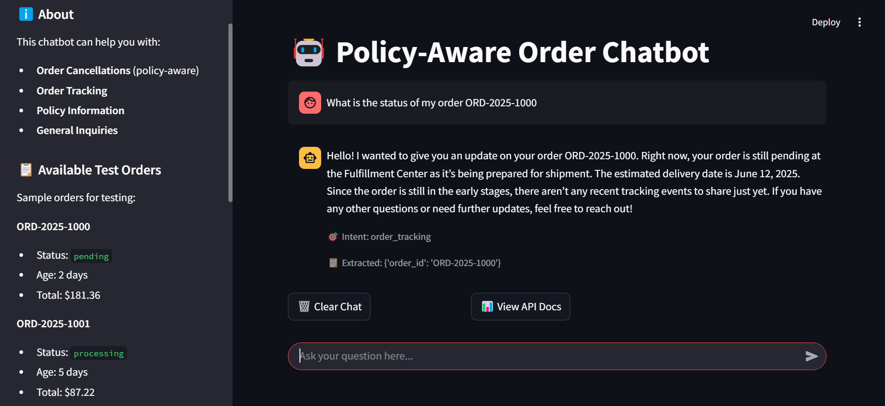
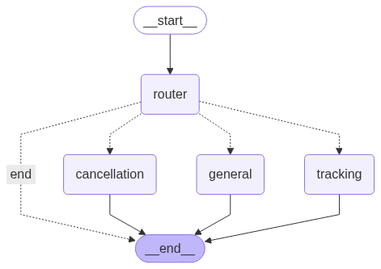

# Policy-Aware Order Chatbot

This project implements a generative chatbot that uses a Large Language Model (LLM) to handle customer inquiries about order cancellation and tracking, while strictly adhering to company policies. It features API integration for order management and a robust evaluation framework.

## UI Preview


## Features

-   **Generative Chatbot**: Utilizes an LLM (via Instructor, LangChain and LangGraph) for natural and context-aware conversations.
-   **Policy Enforcement**: Integrates a `PolicyEngine` to ensure all actions comply with defined business rules (e.g., order cancellation window).
-   **API Integration**: Connects to a mock `OrderService` to fetch order details, track shipments, and process cancellations.
-   **Modular Design**: Built with FastAPI for the API layer, Pydantic for data validation, and a clear separation of concerns between agents, services, and policy logic.
-   **Advanced Evaluation**: Includes a comprehensive evaluation suite (`evaluation.py`) using a variety of test cases and metrics, including LLM-as-a-judge for response quality.
-   **Dependency Management**: Uses `uv` for efficient package management.

## Project Structure

```
.
├── chatbot/                # Core chatbot logic
│   ├── agents.py           # LangGraph agents and main chatbot orchestration
│   ├── order_service.py    # Mock order management service
│   ├── policy_engine.py    # Business policy enforcement logic
│   └── __init__.py
├── data/                   # Sample data?
├── evaluation_results/     # Directory where evaluation outputs will be saved
├── .git/
├── .gitignore
├── .pytest_cache/
├── .venv/
├── __pycache__/
├── .python-version
├── analysis.ipynb          # Jupyter notebook for deeper analysis
├── Report.md               # Report on evaluation results and insights
├── demo.py                 # Interactive demo script
├── evaluation.py           # Chatbot evaluation framework
├── main.py                 # FastAPI application
├── pyproject.toml          # Project metadata and dependencies for uv
├── README.md               # This file
├── Solution_Design.md      # Detailed explanation of the solution architecture( maybe should be merged into Report.md?)
├── streamlit_app.py        # Streamlit web UI for easy interaction
├── test_chatbot.py         # Unit/integration tests for the chatbot
├── test_system.py          # System tests
└── uv.lock                 # Lock file for reproducible builds with uv
```

## Agent Graph Visualization

The following diagram illustrates the agent graph structure, showing the flow of conversation between different specialized agents:



## Setup

1.  **Clone the repository:**
    ```bash
    git clone https://github.com/dnlgsv/policy-aware-order-chatbot.git
    cd policy-aware-order-chatbot
    ```

2.  **Install dependencies using `uv`:**

    Use pip to install `uv`:
    ```bash
    pip install uv
    ```
    or follow the instructions at [https://github.com/astral-sh/uv](https://github.com/astral-sh/uv).
    ```bash
    uv sync
    ```

3.  **Set up OpenAI API Key:**
    Create a `.env` file in the root of the project directory:
    ```
    OPENAI_API_KEY="your_openai_api_key_here"
    ```
    Replace `"your_openai_api_key_here"` with your actual OpenAI API key. The application uses `python-dotenv` to load this key.

## Running the Application

### Option 1: Local Development (Direct)

1.  **Start the FastAPI server:**
    ```bash
    uv run uvicorn main:app --reload --port 8000
    ```
    The API will be accessible at `http://localhost:8000`.

2.  **Run the Interactive Demo (Optional):**
    ```bash
    uv run python demo.py
    ```
    This script provides a command-line interface to interact with the chatbot.

3.  **Run the Streamlit Web UI (Recommended):**
    ```bash
    uv run streamlit run streamlit_app.py
    ```
    This provides a user-friendly web interface accessible at `http://localhost:8501`.

### Option 2: Docker (Recommended)

1.  **Build and run with Docker Compose:**
    ```bash
    docker-compose up --build
    ```
    This will start both:
    - **API Server**: `http://localhost:8000`
    - **Streamlit UI**: `http://localhost:8501`

2.  **Run in detached mode:**
    ```bash
    docker-compose up -d
    ```

### Docker Commands

- **View logs:** `docker-compose logs -f chatbot` or `docker-compose logs -f streamlit`
- **Stop services:** `docker-compose down`
- **Rebuild:** `docker-compose build --no-cache`
- **Run tests in container:** `docker-compose exec chatbot uv run python -m pytest`

## Running the Evaluation

To assess the chatbot's performance:

1.  **Ensure your `OPENAI_API_KEY` is correctly set in the `.env` file.** The evaluation script uses LLM calls for response quality assessment.

2.  **Run the evaluation script:**
    ```bash
    uv run python evaluation.py
    ```
    This will execute a series of predefined test cases, calculate various metrics (intent accuracy, policy compliance, response quality, etc.), and save the results (including a report and plots) in the `evaluation_results/` directory. The console will also print a summary of the metrics.

## Key Technologies Used

-   **Python 3.12+**
-   **FastAPI**: For building the web API.
-   **Pydantic**: For data validation and settings management.
-   **Instructor**: For Structured LLM Outputs.
-   **LangChain**: LLM framework for building context-aware applications.
-   **LangGraph**: For creating agent applications.
-   **OpenAI GPT models**: (e.g., `GPT-4.1 mini`) For NLU, response generation, and LLM-as-a-judge evaluation.
-   **Streamlit**: For the web-based user interface.
-   **uv**: For Python packaging and virtual environment management.
-   **Scikit-learn, Pandas, Matplotlib, Seaborn**: For metrics calculation and results visualization in the evaluation phase.

## Next Steps & Potential Improvements

-   **User Authentication**: Implement user identification to fetch specific user orders without asking for email/order ID repeatedly.
-   **Database Integration**: Replace the mock `OrderService` with a real database connection.
-   **Expanded Policy Engine**: Incorporate more complex policies and a more dynamic way to manage them.
-   **Human Handoff**: Fully implement the human handoff mechanism.
-   **CI/CD Pipeline**: Set up automated testing and deployment.
-   **Advanced RAG**: For more complex queries and more complex policies, implement Retrieval Augmented Generation to pull in information from a knowledge base of policies or FAQs.
